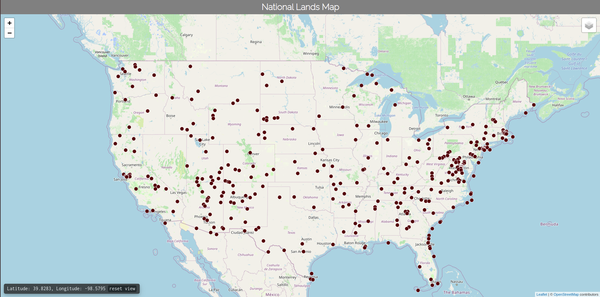

# national-lands-map

Dynamic map using [React Leaflet](https://react-leaflet.js.org/) and data from the [National Park Service](https://www.nps.gov/maps/tools/npmap.js/examples/geojson-layer/) to render locations of public lands in the United States. Uses multiple tiles servers, including [OpenStreetMap](https://www.openstreetmap.org/) and [OpenTopoMap](https://opentopomap.org/about#verwendung).

[Check it out live on Heroku](https://national-lands-map.herokuapp.com/).
